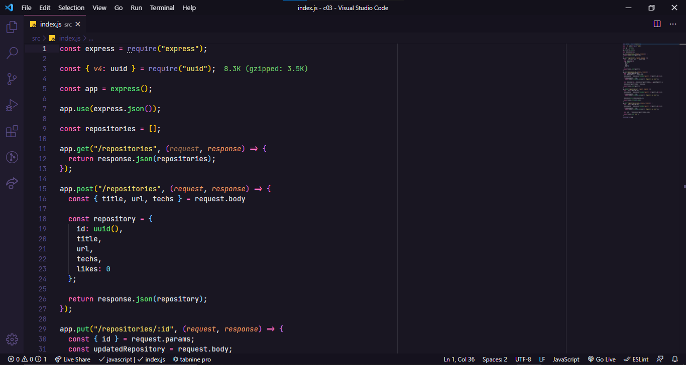

# Desafio 03 - Corrigindo o código

<div align="center">
    

Este desafio faz parte da lista de desafios que compõem o curso de NodeJS. 

Visite à [Rockseat](https://rocketseat.com.br/) para saber mais sobre o curso.
</div>

<p align="center">
  

  <a href="https://rocketseat.com.br">
    
  </a>

  
  
</p>

<p align="center">
  <a href="#rocket-sobre-o-desafio">Sobre o desafio</a>&nbsp;&nbsp;&nbsp;|&nbsp;&nbsp;&nbsp;
  <a href="#keyboard-instalação-e-execução-do-projeto">Instalação e Execução do Projeto</a>&nbsp;&nbsp;&nbsp;|&nbsp;&nbsp;&nbsp;
  <a href="#template-da-aplicação">Template da aplicação</a>&nbsp;&nbsp;&nbsp;|&nbsp;&nbsp;&nbsp;
  <a href="#rotas-da-aplicação-instruções">Rotas da aplicação</a>&nbsp;&nbsp;&nbsp;|&nbsp;&nbsp;&nbsp;
  <a href="#específicação-dos-testes-instruções">Específicação dos testes</a>&nbsp;&nbsp;&nbsp;|&nbsp;&nbsp;&nbsp;
  <a href="#memo-licença">Licença</a>
</p>


## :rocket: Sobre o desafio

Este desafio teve como missão corregir erros de uma aplicação Node.js já em processo de desenvolvimento.

Essa aplicação realiza o CRUD (**C**reate, **R**ead, **U**pdate, **D**elete) de repositórios de projetos. 

Além disso, é possível dar likes em repositórios cadastrados, aumentando a quantidade de likes em 1 a cada vez que a rota é chamada.

A estrutura de um repositório ao ser criado é a seguinte: 

```jsx
{
  id: uuid(),
  title,
  url,
  techs,
  likes: 0
}
```

Descrição de cada propriedade:

- **id** deve ser um uuid válido;
- **title** é o título do repositório (por exemplo "unform");
- **url** é a URL que aponta para o repositório (por exemplo "[https://github.com/unform/unform](https://github.com/unform/unform)");
- **techs** é um array onde cada elemento deve ser uma string com o nome de uma tecnologia relacionada ao repositório (por exemplo: ["react", "react-native", "form"]);
- **likes** é a quantidade de likes que o repositório recebeu (e que vai ser incrementada de 1 em 1 a cada chamada na rota de likes).

Note que a quantidade de likes deve sempre ser zero no momento de criação.

### :keyboard: Instalação e Execução do Projeto

- Clone o repositório

```
https://github.com/code36u4r60/ignite-desafio-corrigindo-o-codigo.git
```

 ou 

```
git@github.com:code36u4r60/ignite-desafio-corrigindo-o-codigo.git
```

ou

```
gh repo clone code36u4r60/ignite-desafio-corrigindo-o-codigo
```

- Entrar na pasta do projeto

```
cd ignite-desafio-corrigindo-o-codigo
```

- Instale as dependências com o Yarn

```
yarn
```

- Executar o projeto

```
yarn dev
```

- Para correr os testes

```
yarn test
```

Deve aparecer uma mensagem parecida com esta:

```
yarn run v1.22.5
$ jest
 PASS  src/__tests__/likes.spec.js
 PASS  src/__tests__/projects.spec.js

Test Suites: 2 passed, 2 total
Tests:       9 passed, 9 total
Snapshots:   0 total
Time:        1.3 s, estimated 2 s
Ran all test suites.
Done in 1.99s.
```


### Template da aplicação

Foi utilizado um modelo de template que possui o esqueleto do projeto.

O template pode ser encontrado na seguinte url: **[Acessar Template](https://github.com/rocketseat-education/ignite-template-corrigindo-o-codigo)**

**Dica**: Caso não saiba utilizar repositórios do Github como template, utilize o guia em **[nosso FAQ](https://www.notion.so/ddd8fcdf2339436a816a0d9e45767664).**

Agora navegue até a pasta criada e abra no Visual Studio Code, lembre-se de executar o comando `yarn` no seu terminal para instalar todas as dependências, e você terá algo parecido com isso:

<p align="center">
  
</p>

## Rotas da aplicação (Instruções)

Com o template já clonado e o arquivo `index.js` aberto, você deve completar onde não possui código com o código para atingir os objetivos de cada teste.

### GET `/repositories`

A rota deve retornar uma lista contendo todos os repositórios cadastrados.

### POST `/repositories`

A rota deve receber `title`, `url` e `techs` pelo corpo da requisição e retornar um objeto com as informações do repositório criado e um status `204`.

### PUT `/repositories/:id`

A rota deve receber `title`, `url` e `techs` pelo corpo da requisição e o `id` do repositório que deve ser atualizado pelo parâmetro da rota. Deve alterar apenas as informações recebidas pelo corpo da requisição e retornar esse repositório atualizado.

### DELETE `/repositories/:id`

A rota deve receber, pelo parâmetro da rota, o `id` do repositório que deve ser excluído e retornar um status `204` após a exclusão.

### POST `/repositories/:id/like`

A rota deve receber, pelo parâmetro da rota, o `id` do repositório que deve receber o like e retornar o repositório com a quantidade de likes atualizada.

## Específicação dos testes (Instruções)

Em cada teste, tem uma breve descrição no que sua aplicação deve cumprir para que o teste passe.

Caso você tenha dúvidas quanto ao que são os testes, e como interpretá-los, dê uma olhada em **[nosso FAQ](https://www.notion.so/FAQ-Desafios-ddd8fcdf2339436a816a0d9e45767664)**

Para esse desafio, temos os seguintes testes:

### Testes de repositórios

- **Should be able to create a new repository**

Para que esse teste passe, você deve permitir que um novo repositório seja cadastrado pela rota **POST** `/repositories`. Caso precise confirmar o formato do objeto, você pode olhar [aqui.](https://www.notion.so/Desafio-03-Corrigindo-o-c-digo-c15c8a2e212846039a367cc7b763c6dd) 

Também é necessário que você retorne a resposta com o código `201`.

- **Should be able to list the projects**

Para que esse teste passe, é necessário que você conclua o teste anterior. Se tudo ocorreu bem, os repositórios cadastrados deverão aparecerem na listagem da rota **GET** `/repositories` e esse teste irá passar.

- **Should be able to update repository**

Para que esse teste passe, você deve permitir que um repositório seja atualizado a partir de seu `id` pela rota **PUT** `/repositories/:id` usando as [informações recebidas pelo corpo da requisição](https://www.notion.so/Desafio-03-Corrigindo-o-c-digo-c15c8a2e212846039a367cc7b763c6dd). Lembre-se de manter as informações que não foram passadas pelo corpo, por exemplo:
Se o usuário quiser trocar apenas o `title`, mantenha `url` e `techs` que já estavam no repositório.

- **Should not be able to update a non existing repository**

Para que esse teste passe, você deve verificar se o repositório existe antes de atualizar as informações na rota **PUT** `/repositories/:id`. Caso não exista, retorne um status `404` (que é o status para **Not Found**) com uma mensagem de erro no formato `{ error: "Mensagem do erro" }`.

- **Should not be able to update repository likes manually**

Para que esse teste passe, você deve impedir que a quantidade de likes de um repositório seja alterada manualmente através da rota **PUT** `/repositories/:id`.
Por exemplo:

**Errado:**

```jsx
// Repositório recém criado:
{
	id: "c160a99b-9d3b-4669-8a35-8dce1e8196ec",
	title: "Umbriel",
	techs: ["React", "ReactNative", "TypeScript", "ContextApi"],
	url: "https://github.com/Rocketseat/umbriel",
	likes: 0
}

// Requisição para alterar informações: 
// Rota: "/repositories/c160a99b-9d3b-4669-8a35-8dce1e8196ec"
// Método: PUT
// Corpo: { title: "Novo título", likes: 10 }

// Retorno:

{
	id: "c160a99b-9d3b-4669-8a35-8dce1e8196ec",
	title: "Novo título",
	techs: ["React", "ReactNative", "TypeScript", "ContextApi"],
	url: "https://github.com/Rocketseat/umbriel",
	likes: 10
}
```

**Certo:**

```jsx
// Repositório recém criado:
{
	id: "c160a99b-9d3b-4669-8a35-8dce1e8196ec",
	title: "Umbriel",
	techs: ["React", "ReactNative", "TypeScript", "ContextApi"],
	url: "https://github.com/Rocketseat/umbriel",
	likes: 0
}

// Requisição para alterar informações: 
// Rota: "/repositories/c160a99b-9d3b-4669-8a35-8dce1e8196ec"
// Método: PUT
// Corpo: { title: "Novo título", likes: 10 }

// Retorno:

{
	id: "c160a99b-9d3b-4669-8a35-8dce1e8196ec",
	title: "Novo título",
	techs: ["React", "ReactNative", "TypeScript", "ContextApi"],
	url: "https://github.com/Rocketseat/umbriel",
	likes: 0 // A quantidade de likes não mudou
}
```

- **Should be able to delete the repository**

Para que esse teste passe, você deve permitir que um repositório seja excluído através do `id` passado pela rota **DELETE** `/repositories/:id`.

- **Should not be able to delete a non existing repository**

Para que esse teste passe, você deve validar se o repositório existe antes de excluí-lo. Caso o repositório não exista, retorne um status `404` com uma mensagem de erro no formato `{ error: "Mensagem do erro" }`.

### Testes de likes

- **Should be able to give a like to the repository**

Para que esse teste passe, deve ser possível incrementar a quantidade de likes em `1` a cada chamada na rota **POST** `/repositories/:id/like`. Use o `id` passado por parâmetro na rota para realizar essa ação.

- **Should not be able to give a like to a non existing repository**

Para que esse teste passe, você deve validar que um repositório existe antes de incrementar a quantidade de likes. Caso não exista, retorne um status `404` com uma mensagem de erro no formato `{ error: "Mensagem do erro" }`.


## :memo: Licença

Esse projeto está sob a licença MIT. Veja o arquivo [LICENSE](https://github.com/git/git-scm.com/blob/master/MIT-LICENSE.txt) para mais detalhes.

---

Created with 💜 by <a href="https://www.linkedin.com/in/eduardoqueiros/">Eduardo Queirós</a> :wave:
